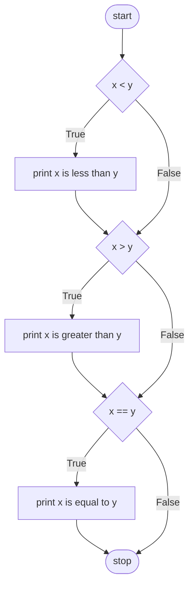
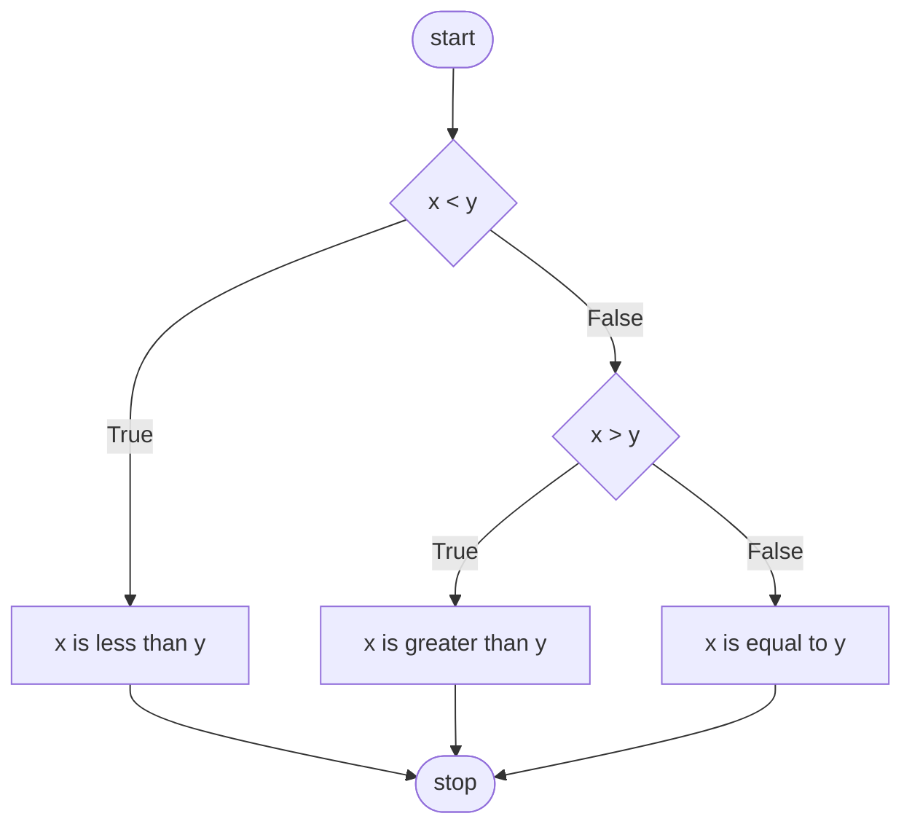

# 🐍 Python Basics — Conditionals (CS50P Lecture 1 Notes)

> Part 2 of the series. If you haven't yet, start with [Lecture 0 — Functions & Variables](#) first — this picks up right where that left off.
> Beginner-friendly notes based on **CS50's Introduction to Programming with Python — Lecture 1**.

📺 Original video: [CS50P Lecture 1 — Conditionals](https://youtu.be/_b6NgY_pMdw)
📚 Official notes: [cs50.harvard.edu/python/notes/1](https://cs50.harvard.edu/python/notes/1/)

---

## 📖 Table of Contents

1. [Prerequisites](#-prerequisites)
2. [What is a Conditional?](#-what-is-a-conditional)
3. [Comparison Operators](#-comparison-operators)
4. [Your First `if` Statement](#-your-first-if-statement)
5. [The Problem With Multiple `if`s](#-the-problem-with-multiple-ifs)
6. [`elif` — Making Fewer Decisions](#-elif--making-fewer-decisions)
7. [`else` — The Catch-All](#-else--the-catch-all)
8. [`or` — Either Condition Works](#-or--either-condition-works)
9. [`!=` — An Even Cleaner `or`](#--an-even-cleaner-or)
10. [`and` — Both Conditions Must Be True](#-and--both-conditions-must-be-true)
11. [Chaining Comparisons (the Pythonic Way)](#-chaining-comparisons-the-pythonic-way)
12. [Simplifying Further](#-simplifying-further)
13. [Modulo (`%`) — Finding Remainders](#-modulo--finding-remainders)
14. [Writing Your Own Boolean Function](#-writing-your-own-boolean-function)
15. ["Pythonic" Code](#-pythonic-code)
16. [`match` — An Alternative to Many `elif`s](#-match--an-alternative-to-many-elifs)
17. [Summary](#-summary)
18. [Practice Ideas](#-practice-ideas)

---

## ✅ Prerequisites

- Comfortable creating and running a `.py` file (`code filename.py` then `python filename.py`)
- Comfortable with variables, `input()`, and type casting (`int()`, `float()`) — covered in [Lecture 0](#)

---

## 🤔 What is a Conditional?

A **conditional** lets your program make decisions — like a fork in the road. Depending on some condition, your program takes one path or another.

Think of it like this: *"If it's raining, bring an umbrella. Otherwise, don't."* That's exactly the logic we're about to teach Python.

---

## ⚖️ Comparison Operators

Python gives you a set of operators to ask "questions" that compare two values:

| Operator | Meaning |
|---|---|
| `<` | less than |
| `>` | greater than |
| `<=` | less than or equal to |
| `>=` | greater than or equal to |
| `==` | equal to (comparison) |
| `!=` | not equal to |

> ⚠️ **Huge beginner trap:** `=` assigns a value (`x = 5` means "put 5 into x"). `==` *compares* two values (`x == 5` means "is x equal to 5?"). Mixing these up is one of the most common early bugs — Python will usually throw an error if you use `=` where `==` belongs.

---

## 🔀 Your First `if` Statement

Create a new file:

```bash
code compare.py
```

```python
x = int(input("What's x? "))
y = int(input("What's y? "))

if x < y:
    print("x is less than y")
```

Here's what's happening:
- We take two inputs and cast them to integers.
- `if x < y:` asks a **Boolean question** — is this `True` or `False`?
- If it's `True`, the **indented block** underneath runs. If `False`, Python just skips it.

⚠️ **Indentation is not optional in Python.** The indented line(s) under `if` are what belong to that `if`. Unindented code is not part of it.

---

## 🚧 The Problem With Multiple `if`s

What if we want to handle *all three* possibilities — less than, greater than, equal to? A naive first attempt:

```python
x = int(input("What's x? "))
y = int(input("What's y? "))

if x < y:
    print("x is less than y")
if x > y:
    print("x is greater than y")
if x == y:
    print("x is equal to y")
```

This works, but it's wasteful. Python checks **all three** conditions every single time, even though only one can ever be true. This flow — one `if` after another — is called **control flow**.



---

## 🔗 `elif` — Making Fewer Decisions

`elif` means "else, if" — check this *only if* the previous condition(s) failed:

```python
x = int(input("What's x? "))
y = int(input("What's y? "))

if x < y:
    print("x is less than y")
elif x > y:
    print("x is greater than y")
elif x == y:
    print("x is equal to y")
```

Now, the moment one condition is `True`, Python skips the rest entirely — it doesn't waste time checking conditions it doesn't need to. On a small script this barely matters, but imagine a server handling billions of requests a day — small efficiencies like this add up fast.

---

## 🧺 `else` — The Catch-All

Think about it logically: if `x` is **not** less than `y`, and `x` is **not** greater than `y`... it *must* be equal to `y`. We don't even need to check!

```python
x = int(input("What's x? "))
y = int(input("What's y? "))

if x < y:
    print("x is less than y")
elif x > y:
    print("x is greater than y")
else:
    print("x is equal to y")
```

`else` is your **default** — "if nothing else matched, do this."



---

## 🔀 `or` — Either Condition Works

Let's solve a different problem: "is x *not equal* to y?" One approach uses `or`:

```python
x = int(input("What's x? "))
y = int(input("What's y? "))

if x < y or x > y:
    print("x is not equal to y")
else:
    print("x is equal to y")
```

`or` means: **if at least one** of the conditions is `True`, the whole thing is `True`.

---

## ➖ `!=` — An Even Cleaner `or`

Turns out, Python already has a built-in operator for exactly this: "not equal to."

```python
x = int(input("What's x? "))
y = int(input("What's y? "))

if x != y:
    print("x is not equal to y")
else:
    print("x is equal to y")
```

One question instead of two. This is a great early lesson: **there's often more than one correct way to solve a problem — but favor whichever version is simplest and most readable.**

---

## 🤝 `and` — Both Conditions Must Be True

`and` requires **every** condition to be `True`. Let's build a grading program:

```bash
code grade.py
```

```python
score = int(input("Score: "))

if score >= 90 and score <= 100:
    print("Grade: A")
elif score >= 80 and score < 90:
    print("Grade: B")
elif score >= 70 and score < 80:
    print("Grade: C")
elif score >= 60 and score < 70:
    print("Grade: D")
else:
    print("Grade: F")
```

This works — but notice we never trust that the user typed a *sensible* score (like something between 0–100). Real programs should always be a little skeptical of user input.

---

## ⛓️ Chaining Comparisons (the Pythonic Way)

Python has a neat trick most languages don't: you can **chain** comparisons together like a math inequality:

```python
score = int(input("Score: "))

if 90 <= score <= 100:
    print("Grade: A")
elif 80 <= score < 90:
    print("Grade: B")
elif 70 <= score < 80:
    print("Grade: C")
elif 60 <= score < 70:
    print("Grade: D")
else:
    print("Grade: F")
```

`90 <= score <= 100` reads almost like English: "is score between 90 and 100?"

---

## ✂️ Simplifying Further

Since we're using `elif`, do we even need the *lower* bound check? If we already know `score` isn't ≥ 90 (or we'd have hit the A branch), we only need to check the top of each remaining range:

```python
score = int(input("Score: "))

if score >= 90:
    print("Grade: A")
elif score >= 80:
    print("Grade: B")
elif score >= 70:
    print("Grade: C")
elif score >= 60:
    print("Grade: D")
else:
    print("Grade: F")
```

Fewer questions asked = simpler, more maintainable code. This kind of thinking — "can I remove a redundant check?" — is a skill you'll build over time.

---

## ➗ Modulo (`%`) — Finding Remainders

**Parity** means whether a number is even or odd. Python's `%` (modulo) operator gives you the **remainder** of division.

- `4 % 2` → `0` (divides evenly → even)
- `3 % 2` → `1` (doesn't divide evenly → odd)

```bash
code parity.py
```

```python
x = int(input("What's x? "))

if x % 2 == 0:
    print("Even")
else:
    print("Odd")
```

---

## 🛠️ Writing Your Own Boolean Function

Recall from Lecture 0 that you can write your own functions with `def`. Let's turn our parity check into a reusable function:

```python
def main():
    x = int(input("What's x? "))
    if is_even(x):
        print("Even")
    else:
        print("Odd")


def is_even(n):
    if n % 2 == 0:
        return True
    else:
        return False


main()
```

Notice `if is_even(x):` has no comparison operator at all — that's because `is_even` **returns** a Boolean (`True` or `False`) directly, and `if` just uses that.

---

## ✨ "Pythonic" Code

Python lets you write things in a uniquely compact, almost English-like way. This style is called **"Pythonic."**

**Step 1 — condense the if/else into one line:**

```python
def is_even(n):
    return True if n % 2 == 0 else False
```

**Step 2 — realize `n % 2 == 0` is *already* a Boolean**, so just return it directly:

```python
def is_even(n):
    return n % 2 == 0
```

Same behavior, dramatically shorter. As you grow as a programmer, you'll start recognizing these kinds of simplifications naturally.

---

## 🎯 `match` — An Alternative to Many `elif`s

Sometimes you're comparing one variable against many *specific* values. A long `elif` chain works...

```python
name = input("What's your name? ")

if name == "Harry":
    print("Gryffindor")
elif name == "Hermione":
    print("Gryffindor")
elif name == "Ron":
    print("Gryffindor")
elif name == "Draco":
    print("Slytherin")
else:
    print("Who?")
```

...but you can combine repeated results using `or`:

```python
name = input("What's your name? ")

if name == "Harry" or name == "Hermione" or name == "Ron":
    print("Gryffindor")
elif name == "Draco":
    print("Slytherin")
else:
    print("Who?")
```

Or use Python's `match` statement, which is often cleaner for this exact pattern:

```python
name = input("What's your name? ")

match name:
    case "Harry":
        print("Gryffindor")
    case "Hermione":
        print("Gryffindor")
    case "Ron":
        print("Gryffindor")
    case "Draco":
        print("Slytherin")
    case _:
        print("Who?")
```

`_` is a wildcard — it matches **anything** that didn't match earlier cases, just like `else`.

You can also combine cases using `|` (like `or`):

```python
name = input("What's your name? ")

match name:
    case "Harry" | "Hermione" | "Ron":
        print("Gryffindor")
    case "Draco":
        print("Slytherin")
    case _:
        print("Who?")
```

---

## 📝 Summary

By the end of this lecture, you've learned:

- ✅ Conditionals and Boolean expressions
- ✅ `if` statements
- ✅ Control flow, `elif`, and `else`
- ✅ `or` and `and`
- ✅ `!=` and chained comparisons (`90 <= score <= 100`)
- ✅ Modulo (`%`) for finding remainders / checking parity
- ✅ Writing your own function that returns a Boolean
- ✅ "Pythonic" ways to simplify code
- ✅ `match` statements as an alternative to long `elif` chains

---

## 💪 Practice Ideas

1. Write a program `leap_year.py` that asks for a year and prints whether it's a leap year (hint: you'll need `and`/`or` together — a year is a leap year if divisible by 4, *except* years divisible by 100, *unless* also divisible by 400).
2. Rewrite the `grade.py` program using a `match` statement instead of `if`/`elif`.
3. Write a function `is_vowel(letter)` that returns `True` if the letter is a vowel, using `match` with `|` to combine cases.
4. Extend `compare.py` to also tell the user whether `x` is positive, negative, or zero — using the fewest possible conditions.

---

## 📚 Resources

- [CS50P official course](https://cs50.harvard.edu/python/)
- [Official Lecture 1 notes](https://cs50.harvard.edu/python/notes/1/)
- [Python docs: control flow](https://docs.python.org/3/tutorial/controlflow.html)
- [Python docs: `match` statements](https://docs.python.org/3/reference/compound_stmts.html#the-match-statement)

---

⭐ Continuing the series? Next up is **Loops** — star this repo to keep track as more lecture notes get added!
