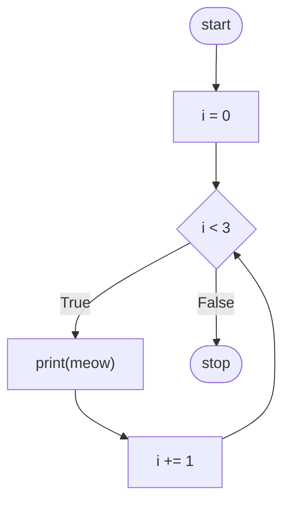

# 🐍 Python Basics — Loops (CS50P Lecture 2 Notes)

> Part 3 of the series. Make sure you've been through [Lecture 0 — Functions & Variables](#) and [Lecture 1 — Conditionals](#) first — this builds directly on both.
> Beginner-friendly notes based on **CS50's Introduction to Programming with Python — Lecture 2**.

📺 Original video: [CS50P Lecture 2 — Loops](https://youtu.be/-7xg8pGcP6w)
📚 Official notes: [cs50.harvard.edu/python/notes/2](https://cs50.harvard.edu/python/notes/2/)

---

## 📖 Table of Contents

1. [Prerequisites](#-prerequisites)
2. [Why Loops?](#-why-loops)
3. [`while` Loops](#-while-loops)
4. [Fixing the Infinite Loop](#-fixing-the-infinite-loop)
5. [Counting the "Right" Way](#-counting-the-right-way)
6. [`for` Loops and Lists](#-for-loops-and-lists)
7. [`range()` — Looping Without a List](#-range--looping-without-a-list)
8. [The Underscore `_` Trick](#-the-underscore-_-trick)
9. [Thinking Outside the Loop](#-thinking-outside-the-loop)
10. [Validating User Input](#-validating-user-input)
11. [`continue` and `break`](#-continue-and-break)
12. [Cleaning It Up With Functions](#-cleaning-it-up-with-functions)
13. [Lists in Depth](#-lists-in-depth)
14. [`len()` — How Long Is That List?](#-len--how-long-is-that-list)
15. [Dictionaries](#-dictionaries)
16. [Lists of Dictionaries](#-lists-of-dictionaries)
17. [Mini Project: Mario Bricks](#-mini-project-mario-bricks)
18. [Summary](#-summary)
19. [Practice Ideas](#-practice-ideas)

---

## ✅ Prerequisites

- Comfortable with variables, `input()`, `def` functions, and `return` (Lecture 0)
- Comfortable with `if`/`elif`/`else` and Boolean logic (Lecture 1)

---

## 🔁 Why Loops?

Imagine you want to print `"meow"` three times:

```python
print("meow")
print("meow")
print("meow")
```

That works. But what if you wanted to meow **500 times**? Copy-pasting the same line 500 times would be absurd. Any time you catch yourself repeating the same code over and over, that's your cue: **use a loop.**

A **loop** is a block of code that runs over and over again, automatically.

---

## 🔄 `while` Loops

The `while` loop is nearly universal across every programming language. It keeps repeating a block of code **as long as** a condition stays `True`.

```bash
code cat.py
```

```python
i = 3
while i != 0:
    print("meow")
```

Run this... and it never stops. It's an **infinite loop**, because `i` never changes — the condition `i != 0` is always `True`. If you're ever stuck in an infinite loop, press **Ctrl+C** in the terminal to break out.

---

## 🛑 Fixing the Infinite Loop

We need to actually change `i` inside the loop:

```python
i = 3
while i != 0:
    print("meow")
    i = i - 1
```

Now each pass through the loop — called an **iteration** — reduces `i` by 1, until `i` hits `0` and the condition becomes `False`.

> 💡 **Iteration** just means "one cycle through the loop." Programmers count the very first pass as the "0th" iteration, then "1st," and so on — because in programming, we count starting from `0`.

---

## 🔢 Counting the "Right" Way

Let's rewrite it counting *upward* like humans normally do:

```python
i = 1
while i <= 3:
    print("meow")
    i = i + 1
```

This works and meows 3 times. But in programming, it's best practice to **start counting at 0**:

```python
i = 0
while i < 3:
    print("meow")
    i += 1
```

`i += 1` is shorthand for `i = i + 1` — you'll see this everywhere in Python code.



Notice the loop counts `i` **up to, but not through**, `3` — that's why we get exactly 3 meows (`0`, `1`, `2`).

---

## 📋 `for` Loops and Lists

A `for` loop works differently — it iterates through a **list** of items directly (think: a grocery list, a to-do list).

```python
for i in [0, 1, 2]:
    print("meow")
```

Much cleaner than the `while` version! `i` takes on `0`, then `1`, then `2`, printing `"meow"` each time.

---

## 🎯 `range()` — Looping Without a List

What if you wanted to meow a **million** times? Typing `[0, 1, 2, ..., 999999]` by hand isn't realistic. Python's `range()` generates a sequence of numbers for you:

```python
for i in range(3):
    print("meow")
```

`range(3)` produces `0`, `1`, `2` automatically — no matter how big the number, Python handles it instantly.

---

## ➖ The Underscore `_` Trick

Look closely: we never actually *use* `i` inside the loop body — it's just there because Python's `for` syntax requires *some* variable name. When a loop variable is unused, Python convention is to name it `_`:

```python
for _ in range(3):
    print("meow")
```

Behaves identically — but signals to any human reading your code: "this variable doesn't matter, only the number of iterations does."

---

## 🧠 Thinking Outside the Loop

Sometimes the "loopy" solution isn't even the best one. Python lets you multiply strings directly:

```python
print("meow" * 3)
```

**Output:** `meowmeowmeow` — no loop needed at all! Want each on its own line?

```python
print("meow\n" * 3, end="")
```

The `\n` adds a line break after each `"meow"`, and `end=""` stops `print` from adding one more break at the very end.

> 🎯 This is a great early lesson: before reaching for a loop, ask yourself if there's an even simpler built-in way to do it.

---

## ✅ Validating User Input

A very common real-world pattern: keep asking the user for input **until** they give you something valid.

```python
while True:
    n = int(input("What's n? "))
    if n < 0:
        continue
    else:
        break
```

Two new keywords here:

| Keyword | What it does |
|---|---|
| `continue` | Skip the rest of this iteration, jump back to the top of the loop |
| `break` | Exit the loop immediately, even if the condition is still `True` |

`while True:` creates a loop that runs **forever** — until something inside explicitly `break`s out of it.

---

## 🚪 `continue` and `break`

Turns out, in this example `continue` is redundant — we can simplify:

```python
while True:
    n = int(input("What's n? "))
    if n > 0:
        break

for _ in range(n):
    print("meow")
```

The `while True` loop keeps re-asking for `n` forever, until the user types something greater than `0` — then it `break`s, and the program moves on to the `for` loop below.

---

## 🧹 Cleaning It Up With Functions

Bringing back what you learned about `def` and `return` in Lecture 0:

```python
def main():
    meow(get_number())


def get_number():
    while True:
        n = int(input("What's n? "))
        if n > 0:
            return n


def meow(n):
    for _ in range(n):
        print("meow")


main()
```

Notice `get_number()` uses `return n` instead of `break` — the moment we have a valid number, we hand it straight back to whoever called the function. Clean separation of concerns: one function *gets* the number, another *uses* it.

---

## 📚 Lists in Depth

Let's explore lists further using the Harry Potter universe:

```bash
code hogwarts.py
```

```python
students = ["Hermione", "Harry", "Ron"]

print(students[0])
print(students[1])
print(students[2])
```

Each item in a list has an **index** — its position, starting at `0`. `students[0]` is `"Hermione"`.

Instead of printing each index manually, loop through the whole list:

```python
students = ["Hermione", "Harry", "Ron"]

for student in students:
    print(student)
```

Notice we *didn't* use `_` here — because `student` is actually being used inside the loop.

---

## 📏 `len()` — How Long Is That List?

Want the student's position **and** their name? Combine `range()` with `len()`:

```python
students = ["Hermione", "Harry", "Ron"]

for i in range(len(students)):
    print(i + 1, students[i])
```

`len(students)` tells you how many items are in the list — so your loop automatically adapts if the list grows or shrinks, without you touching the code.

---

## 🗂️ Dictionaries

A **list** stores multiple values. A **dictionary** (`dict`) stores **key → value** pairs — great for associating related data.

You *could* use two parallel lists:

```python
students = ["Hermione", "Harry", "Ron", "Draco"]
houses = ["Gryffindor", "Gryffindor", "Gryffindor", "Slytherin"]
```

...but this is fragile (easy to get the order mixed up). A dictionary is cleaner:

```python
students = {
    "Hermione": "Gryffindor",
    "Harry": "Gryffindor",
    "Ron": "Gryffindor",
    "Draco": "Slytherin",
}

print(students["Hermione"])
print(students["Harry"])
```

**Output:**
```
Gryffindor
Gryffindor
```

Loop through just the keys:

```python
for student in students:
    print(student)
```

Loop through keys **and** their values:

```python
for student in students:
    print(student, students[student], sep=", ")
```

**Output:**
```
Hermione, Gryffindor
Harry, Gryffindor
Ron, Gryffindor
Draco, Slytherin
```

`sep=", "` tells `print` to join its arguments with `", "` instead of a space.

---

## 🧩 Lists of Dictionaries

What if each student needs *multiple* pieces of data (house, patronus, etc.)? Combine both structures — a **list of dictionaries**:

```python
students = [
    {"name": "Hermione", "house": "Gryffindor", "patronus": "Otter"},
    {"name": "Harry", "house": "Gryffindor", "patronus": "Stag"},
    {"name": "Ron", "house": "Gryffindor", "patronus": "Jack Russell terrier"},
    {"name": "Draco", "house": "Slytherin", "patronus": None},
]

for student in students:
    print(student["name"], student["house"], student["patronus"], sep=", ")
```

Notice `None` — Python's special way of saying "no value here." Draco's patronus is unknown (or he doesn't have one).

This pattern — a list of dictionaries — is extremely common in real-world programming (think: rows from a database, or JSON data from a web API).

---

## 🍄 Mini Project: Mario Bricks

Let's put loops to real use, recreating the look of Mario's brick blocks.

**Step 1 — the lazy way:**

```python
print("#")
print("#")
print("#")
```

**Step 2 — use a loop:**

```python
for _ in range(3):
    print("#")
```

**Step 3 — wrap it in a reusable function:**

```python
def main():
    print_column(3)


def print_column(height):
    for _ in range(height):
        print("#")


main()
```

Now the column can be **any** height, with zero hardcoding.

**A row instead of a column?**

```python
def main():
    print_row(4)


def print_row(width):
    print("?" * width)


main()
```

**Combine rows and columns into a square (nested loops!):**

```python
def main():
    print_square(3)


def print_square(size):
    # For each row in square
    for i in range(size):
        # For each brick in row
        for j in range(size):
            print("#", end="")
        # Move to the next line
        print()


main()
```

The **outer loop** handles each row; the **inner loop** prints each brick within that row. This pattern — a loop inside a loop, called a **nested loop** — is everywhere in programming (grids, tables, images, game boards).

**Even cleaner, by reusing `print_row`:**

```python
def main():
    print_square(3)


def print_square(size):
    for i in range(size):
        print_row(size)


def print_row(width):
    print("#" * width)


main()
```

---

## 📝 Summary

By the end of this lecture, you've learned:

- ✅ `while` loops, and how to avoid infinite loops
- ✅ Iteration, and counting from `0`
- ✅ `for` loops over lists
- ✅ `range()` for looping a specific number of times
- ✅ The `_` convention for unused loop variables
- ✅ `continue` and `break`
- ✅ Validating user input with loops
- ✅ Lists — indexing and looping
- ✅ `len()`
- ✅ Dictionaries (`dict`) — key/value pairs
- ✅ Lists of dictionaries for structured data
- ✅ Nested loops for 2D patterns

---

## 💪 Practice Ideas

1. Write a program that asks the user for a number `n`, then prints a triangle of `#` that grows one row at a time up to height `n` (hint: nested loop, inner loop size changes each row).
2. Build a small "gradebook": a list of dictionaries with `name` and `score` keys, then loop through and print each student's letter grade using what you learned about conditionals in Lecture 1.
3. Rewrite the Mario square program to print a **rectangle** (different width and height) instead of a square.
4. Using a dictionary, build a simple phonebook (`name` → `number`) and write a loop that lets the user look someone up.

---

## 📚 Resources

- [CS50P official course](https://cs50.harvard.edu/python/)
- [Official Lecture 2 notes](https://cs50.harvard.edu/python/notes/2/)
- [Python docs: `list`s](https://docs.python.org/3/tutorial/datastructures.html#more-on-lists)
- [Python docs: `dict`s](https://docs.python.org/3/tutorial/datastructures.html#dictionaries)
- [Python docs: `len()`](https://docs.python.org/3/library/functions.html?highlight=len#len)

---

⭐ Next up in the series: **Exceptions** — star this repo to keep track as more lecture notes get added!
