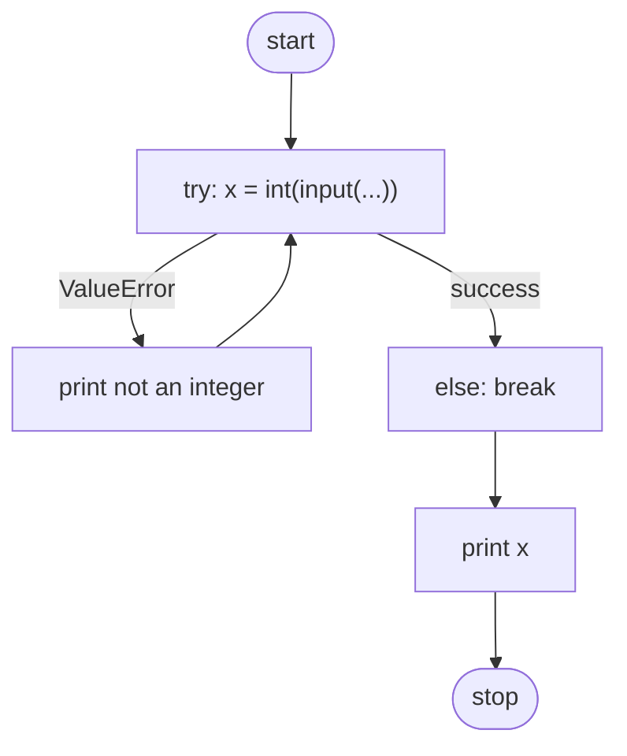

# 🐍 Python Basics — Exceptions (CS50P Lecture 3 Notes)

> Part 4 of the series. Make sure you've been through [Lecture 0 — Functions & Variables](#), [Lecture 1 — Conditionals](#), and [Lecture 2 — Loops](#) first — this builds directly on all three.
> Beginner-friendly notes based on **CS50's Introduction to Programming with Python — Lecture 3**.

📺 Original video: [CS50P Lecture 3 — Exceptions](https://youtu.be/LW7g1169v7w)
📚 Official notes: [cs50.harvard.edu/python/notes/3](https://cs50.harvard.edu/python/notes/3/)

---

## 📖 Table of Contents

1. [Prerequisites](#-prerequisites)
2. [What is an Exception?](#-what-is-an-exception)
3. [Syntax Errors vs Runtime Errors](#-syntax-errors-vs-runtime-errors)
4. [When Users Misbehave](#-when-users-misbehave)
5. [`try` / `except` — Catching Errors](#-try--except--catching-errors)
6. [Try the Fewest Lines Possible](#-try-the-fewest-lines-possible)
7. [`else` — Only Runs If Nothing Broke](#-else--only-runs-if-nothing-broke)
8. [Don't Give Up — Keep Asking](#-dont-give-up--keep-asking)
9. [Abstracting It Into a Function](#-abstracting-it-into-a-function)
10. [Returning Straight From the `try`](#-returning-straight-from-the-try)
11. [`pass` — Fail Silently](#-pass--fail-silently)
12. [Making the Prompt Reusable](#-making-the-prompt-reusable)
13. [Summary](#-summary)
14. [Practice Ideas](#-practice-ideas)

---

## ✅ Prerequisites

- Comfortable with `if`/`elif`/`else` (Lecture 1)
- Comfortable with `while` loops and `break` (Lecture 2)
- Comfortable writing your own functions with `def` and `return` (Lecture 0)

---

## 💥 What is an Exception?

An **exception** is something that goes wrong while your code is running. Not every mistake is your fault as the programmer — sometimes it's the *user* who does something unexpected, like typing letters where you expected a number.

Learning to anticipate and gracefully handle these situations is what makes code feel *professional* instead of fragile.

---

## 🔍 Syntax Errors vs Runtime Errors

Create a file:

```bash
code hello.py
```

Type this (with an intentional mistake — a missing closing quote):

```python
print("hello, world)
```

Run it:

```bash
python hello.py
```

Python reports a **`SyntaxError`**. This means: *you*, the programmer, typed something incorrectly. The fix is always to re-read your code carefully.

Now let's look at a different kind of problem — a **runtime error**, which happens *while the program is running*, often because of unexpected user input:

```bash
code number.py
```

```python
x = int(input("What's x? "))
print(f"x is {x}")
```

If the user types a normal number like `50`, this works fine. But what if they type `"cat"` instead — or just hit Enter without typing anything? Try it, and you'll see:

```
ValueError: invalid literal for int() with base 10: 'cat'
```

The `int()` function simply doesn't know how to turn `"cat"` into a number. This crashes the whole program.

> 🎯 **Golden rule:** as programmers, we should be *defensive* — never fully trust that users will type what we expect. Someone, somewhere, will always type something you didn't anticipate.

---

## 😈 When Users Misbehave

At this point you might think: "I'll just use an `if` statement to check the input first!" That can work in some cases, but Python gives us a purpose-built tool for exactly this kind of problem: **`try` and `except`**.

---

## 🛡️ `try` / `except` — Catching Errors

```python
try:
    x = int(input("What's x?"))
    print(f"x is {x}")
except ValueError:
    print("x is not an integer")
```

Read this like English: *"**Try** to do this. **Except**, if a `ValueError` happens, do this instead."*

- Type `50` → works fine, prints `x is 50`.
- Type `cat` → Python jumps straight into the `except` block instead of crashing, and prints a friendly message.

This is called **handling** the exception — your program survives instead of crashing.

---

## ✂️ Try the Fewest Lines Possible

Good practice: only put the code that *might* fail inside `try` — not extra lines that don't need protecting.

```python
try:
    x = int(input("What's x?"))
except ValueError:
    print("x is not an integer")

print(f"x is {x}")
```

Run this and type `cat`... and you get a **brand new error**:

```
NameError: name 'x' is not defined
```

**Why?** Look closely at `x = int(input("What's x?"))`. Python evaluates the right-hand side first. If `int(...)` fails, the assignment to `x` never happens at all — so by the time we reach `print(f"x is {x}")`, `x` was never created.

This is a subtle but important lesson: **a failed line doesn't "partially" run** — if the right side throws an error, the left side variable is never assigned.

---

## 🔀 `else` — Only Runs If Nothing Broke

Python's `try` statement has an `else` clause too — it only runs if the `try` block succeeded with **no exception at all**:

```python
try:
    x = int(input("What's x?"))
except ValueError:
    print("x is not an integer")
else:
    print(f"x is {x}")
```

Now:
- Type `50` → no error → `else` runs → prints `x is 50`.
- Type `cat` → `ValueError` → `except` runs instead, `else` is skipped entirely.

This solves the `NameError` from before, because we only ever try to print `x` when we *know* it was successfully assigned.

---

## 🔁 Don't Give Up — Keep Asking

Right now, if the user messes up, the program just... ends. That's a little rude. Let's keep re-prompting them until they get it right, using what you learned about `while` loops in Lecture 2:

```python
while True:
    try:
        x = int(input("What's x?"))
    except ValueError:
        print("x is not an integer")
    else:
        break

print(f"x is {x}")
```

- `while True:` loops forever...
- ...**until** the `try` succeeds, at which point `else` runs `break`, which exits the loop.
- Only *then* do we reach the final `print`, guaranteed to have a valid `x`.



---

## 🧰 Abstracting It Into a Function

You'll want to "safely get an integer from the user" in *many* programs. Time to reuse Lecture 0's lesson about `def` and turn this into its own function:

```python
def main():
    x = get_int()
    print(f"x is {x}")


def get_int():
    while True:
        try:
            x = int(input("What's x?"))
        except ValueError:
            print("x is not an integer")
        else:
            break
    return x


main()
```

Look how clean `main()` becomes — just two lines! All the messy validation logic is tucked away inside `get_int()`, out of sight, out of mind, ready to be reused anywhere.

---

## 🎯 Returning Straight From the `try`

We can simplify `get_int()` further — `return` doesn't just exit a function, it also breaks you clean out of any loop it's inside:

```python
def main():
    x = get_int()
    print(f"x is {x}")


def get_int():
    while True:
        try:
            x = int(input("What's x?"))
        except ValueError:
            print("x is not an integer")
        else:
            return x


main()
```

And we can shrink it even more, by returning the conversion result **directly** inside the `try`:

```python
def main():
    x = get_int()
    print(f"x is {x}")


def get_int():
    while True:
        try:
            return int(input("What's x?"))
        except ValueError:
            print("x is not an integer")


main()
```

Same behavior, fewer lines. This is the kind of refinement that comes with practice — first make it *work*, then make it *clean*.

---

## 🤫 `pass` — Fail Silently

Sometimes you don't want to nag the user with an error message every time — you just want to silently re-ask the question. That's what `pass` is for: it means *"do nothing, move on."*

```python
def main():
    x = get_int()
    print(f"x is {x}")


def get_int():
    while True:
        try:
            return int(input("What's x?"))
        except ValueError:
            pass


main()
```

Now, an invalid input simply results in the prompt appearing again — no scary error text, no extra output. Whether you want to show an error message or fail silently is a **design decision** you'll make based on how you want your program to feel to use.

---

## 📢 Making the Prompt Reusable

Right now, `get_int()` always asks the exact same hardcoded question. Let's make it accept the **prompt text as a parameter**, just like you learned with parameters in Lecture 0:

```python
def main():
    x = get_int("What's x? ")
    print(f"x is {x}")


def get_int(prompt):
    while True:
        try:
            return int(input(prompt))
        except ValueError:
            pass


main()
```

Now `get_int()` is a genuinely reusable tool — you could call `get_int("What's your age? ")` or `get_int("How many tickets? ")` anywhere in any program, and it will always safely validate the input for you.

---

## 📝 Summary

By the end of this lecture, you've learned:

- ✅ What exceptions are, and why they happen
- ✅ Syntax errors vs. runtime errors
- ✅ `try` and `except` for catching `ValueError`s
- ✅ Why you should `try` the fewest lines possible
- ✅ `else` — code that only runs if nothing failed
- ✅ Using a `while` loop to keep re-prompting the user
- ✅ Abstracting validation logic into a reusable function
- ✅ `return` exiting both a loop *and* a function at once
- ✅ `pass` for silently ignoring an exception
- ✅ Passing the prompt text in as a parameter for true reusability

---

## 💪 Practice Ideas

1. Write a `get_float(prompt)` function (like `get_int`, but for decimal numbers) and use it to build a simple calculator.
2. Modify `get_int` to only accept numbers **greater than zero**, re-prompting otherwise (hint: combine `try`/`except` with an `if` from Lecture 1).
3. Write a program that asks the user for a fraction like `"1/3"`, and safely handles both a `ValueError` (bad format) *and* a `ZeroDivisionError` (denominator of 0).
4. Try removing the `except ValueError:` line entirely and see what happens when the input is bad — read the full error message Python gives you. Understanding raw error messages is a skill in itself!

---

## 📚 Resources

- [CS50P official course](https://cs50.harvard.edu/python/)
- [Official Lecture 3 notes](https://cs50.harvard.edu/python/notes/3/)
- [Python docs: Errors and Exceptions](https://docs.python.org/3/tutorial/errors.html)
- [Python docs: `pass` statements](https://docs.python.org/3/tutorial/controlflow.html#pass-statements)

---

⭐ Next up in the series: **Libraries** — star this repo to keep track as more lecture notes get added!
